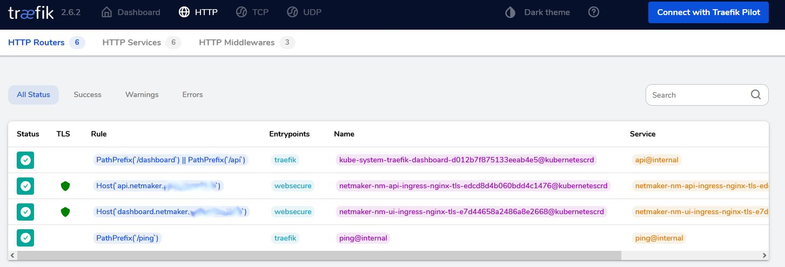
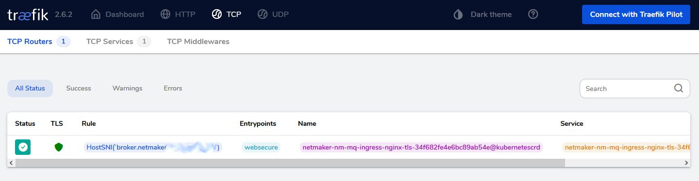

# netmaker-k3s
Run netmaker on a k3s server with defaults.

## Update
Netmaker decided in version 0.14.2 to change the broker(mqtt) communication from port 8883 to 443. This is a fantastic move
since now all communication flows over port 443. The dashboard, api and broker. You notice in the ingress manifest that this
is implemented using a tcp ingress route. Well done, I would say!!!




  
  
Wouldn't it be nice this could be deployed more easily to kubernetes? 
The project offers a helm chart that adds high availability if you are in need of such a thing. I was not. I just wanted to test it in a vm/pi/etc. 
To adapt this to run in a cluster, simply modify the pvc configs to use nfs, longhorn, rook, etc. 

This project contains a deployment that puts the netmaker backend, ui, mqtt and coredns into a few simple pods. The pods are then isolated using network policies. 
The communication between the services within the same pod is facilitated via the loopback interface. 
The database is a sqlite file for simplicity. All the persistant volumes are mapped to a local folder for easy access just like a docker volume mount.

I am using traefik with let'sencrypt here but this can be swapped out to your choice of ingress. 

### 01-namespace.yaml
will create a namespace. If you change the name here you have to change it everywhere.

### 02-pvc.yaml
Before applying this you need to create a few folders. Like this for example:
  
```
mkdir -p /srv/netmaker/nm-dnsconfig-pvc
mkdir -p /srv/netmaker/nm-sqldata-pvc
mkdir -p /srv/netmaker/nm-mq-certs
mkdir -p /srv/netmaker/nm-mq-log
mkdir -p /srv/netmaker/nm-mq-data
chmod 777 /srv/netmaker/*
```
  
But you can see that there are seven pv's. Well k3s local-path provider does not support readWriteMany. Since the dns pvc is mounted to netmaker and coredns at the same time, the workaround is to simply make two pvc's to the same path on disk.  

Also replace HOSTNAME with the name of the vm/host you are running on. 

### 03-nodeports.yaml
These are nodeports for wireguard connections to the container. Every network needs it's own port. This file creates six nodeports. That means you can create six networks before you have to go in here and just add more (copy/paste). 

### 04-mqtt-configmap.yaml
This just needs to be there. It's from the official docker netmaker config. 

### 05-netmaker-backend.yaml
You need to replace BASE_DOMAIN with your domain in all the spots. 

### 06-netmaker-mq.yaml
You need to replace BASE_DOMAIN with your domain in all the spots.

### 07-netmaker-ui.yaml
You need to replace BASE_DOMAIN with your domain in all the spots. 

### 08-ingress.yaml (Using k3s traefik)
You need three domains with let'sencrypt. The dashboard, api and the broker. Note here the special broker config. It's not http.
Replace BASE_DOMAIN with your domain name. Replace cert-provider with your provider. 
  
-- It's functional now. The following manifests implement network policy to improve security posture ---
  
### 90-network-deny.yaml
Optional step 1: It puts a default deny into the network namespace and only allows dns.

### 91-allow-internet.yaml
Optional step 2: Allows for internet acces but not LAN access

### 94-netmaker.yaml
Optional step 3: This policy allows the pods to communicate between each other and traefik. 

### Tip
Once it is running, Coredns created the corefile in the path you specified in 02-pvc. Go there and edit the default forwarder if you like. 
It creates it with 8.8.8.8 but I like to send it to a pi-hole instead. Your choice. 

### In Conclusion
Netmaker works really well now. There is an apt repo to help with the netclient installation and updating. https://docs.netmaker.org/netclient.html#installation
Don't forget to join the official discord. 
